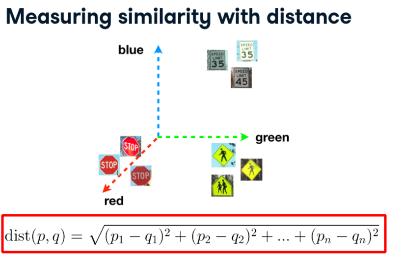
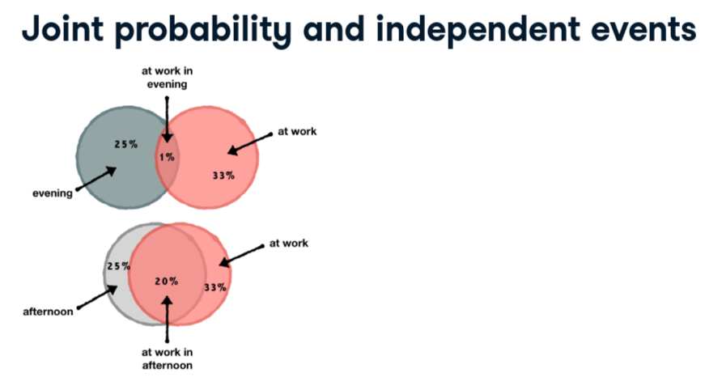
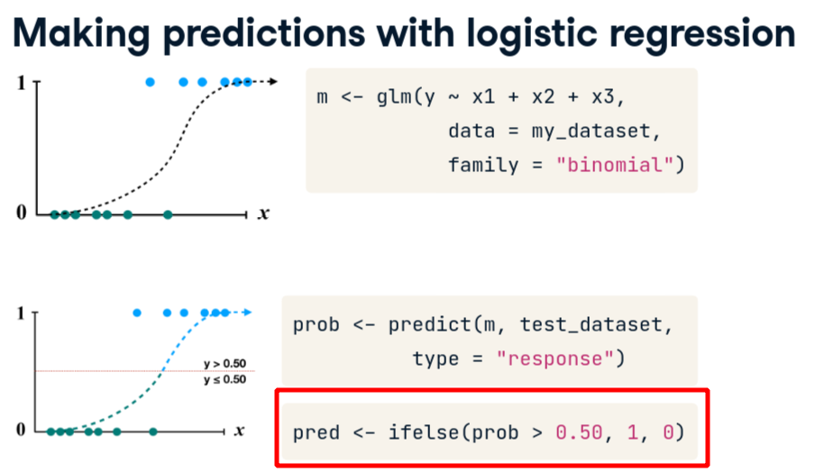
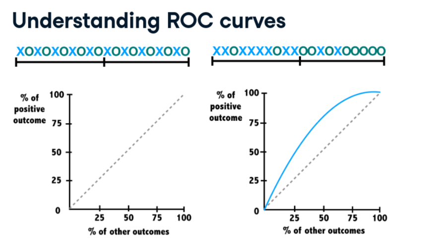
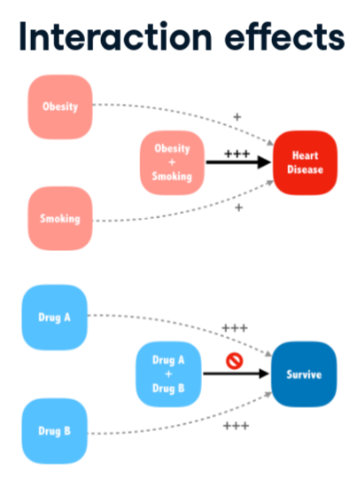
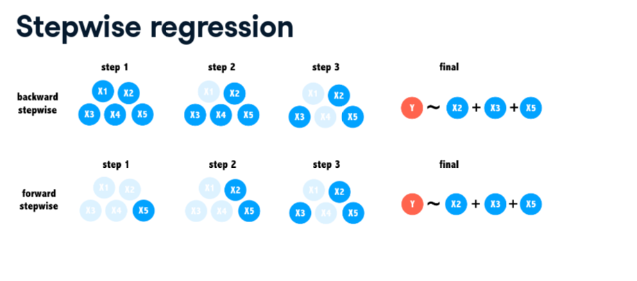
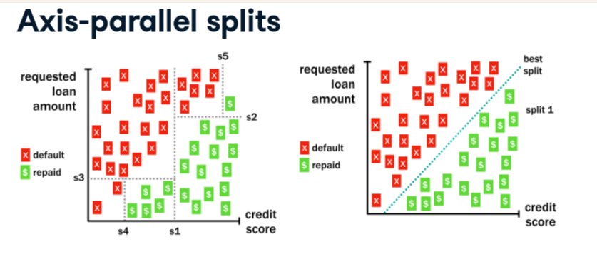

# Supervised Learning in R: Classification
## Brett Lantz

# Chapter 1: k-Nearest Neighbors (kNN)
- The sub-domain of **Supervised Learning** focuses on training a machine to learn from prior examples.
- When a concept to be learned is a set of categories then the task is called Classification.
- A **Nearest Neighbor Classifier** takes advantage of the fact that signs look alike.
- It does this by converting the data into a concept of distance and measures the objects distance from one another.
- Many Nearest Neighbor Algorithms use Euclidean Distance:

- An algorithm called **K-Nearest Neighbors** uses this idea to classify unlabeled examples.
```r
library(class)
pred <- knn(training_data, testing_data, training_labels)
```
- You can use this as a template for running KNNs:
```r
# Load the 'class' package
library(class)

# Create a vector of labels
sign_types <- signs$sign_type

# Classify the next sign observed
knn(train = signs[-1], test = next_sign, cl = sign_types)
```
- You can aggregate over a dataset using:
```
# Check r10's average red level by sign type
aggregate(r10 ~ sign_type, data = signs, mean)
```
- The letter K in *KNN* specifies the number of neighbors to consider when making the classification.
- The default is `K = 1` in R.
- You may need to play around with this value since it can be important to correct classifications.
- Whichever category shows up the most, is the winner.
- Increasing it doesn't necessarily improve importance.
- **Noise** random information independent of the data can cause fuzzy boundaries.
- In practice, the complexity of the data along with how noisy it is.
- A guideline is to take the square root of the number of observations in the data.
- To actually set the value of K:
```
k_7 <- knn(train = signs[-1], test = signs_test[-1], cl = sign_types, k= 7)
mean(signs_actual == k_7)
```
- Knowing more about the voters' confidence in the classification could allow an autonomous vehicle to use caution in the case there is any chance at all that a stop sign is ahead.
- You can set that by passing `prob = TRUE` inside `knn()`.
- You can then get the votes using `sign_prob <- attr(sign_pred, "prob")`
- While all this is useful, we will need to know how to prepare the data for KNN.
- It is assumed that the data is in numerical format since defining distance between categories is challenging.
- A common solution is to **Dummy Code** indicators to represent these categories; using columns with 1/0 filled in.
- When measuring distance, it is important to keep them within the same scale.
- You'll therefore want to normalize numeric data:
```r
normalize <- function(x){
  return((x - min(x))/ (max(x) - min(x)))
}
```

# Chapter 2: Naive Bayes
- Your phone uses your past locations to attempt to predict your most probable future locations.
- The probability of an event is the number of times something did happen over the number of times it could happen.
- When events have a joint probability, these can be displayed using a Venn Diagram.

- **Independent Events** are when one event does not influence the other event.
- **Dependent Events** are when one event does influence the other event.
- There algorithm **Naive Bayes** applies Bayesian methods to estimate the conditional probability of an outcome.
```R
library(naivebayes)
m <- naive_bayes(lication ~ time_of_day, data = location_history)
```
```R
# Compute P(A)
p_A <- nrow(subset(where9am, location == "office")) / nrow(where9am)

# Compute P(B)
p_B <- nrow(subset(where9am, daytype == "weekday")) / nrow(where9am)

# Compute the observed P(A and B)
p_AB <- nrow(subset(where9am, location == "office" & daytype == "weekday")) / nrow(where9am)

# Compute P(A | B) and print its value
p_A_given_B <- p_AB / p_B
p_A_given_B
```
```R
# Load the naivebayes package
library(naivebayes)

# Build the location prediction model
locmodel <- naive_bayes(location ~ daytype, data = where9am)

# Predict Thursday's 9am location
predict(locmodel, newdata = thursday9am)

# Predict Saturdays's 9am location
predict(locmodel, newdata = saturday9am)
```
```R
# Obtain the predicted probabilities for Thursday at 9am
predict(locmodel, newdata = thursday9am , type = 'prob')

# Obtain the predicted probabilities for Saturday at 9am
predict(locmodel, newdata = saturday9am, type = 'prob')
```
- Adding more predictors complicates the model which is why this model is called **Naive** Bayes.
- This is because it assumes that all events are independent of one another.
- While this is not true in the real world, bending this assumption can still net good results.
- Another problem is that if an event exists but has never been observed then the probability is 0.
- Therefore, anything multiplied by 0 is 0 and this method fails.
- To work around this, is to add a very small number - usually 1 - to each event so nothing can be zero.
- This is called a **Laplace Correction** or **Laplace Estimator**.
- You can change this using:
```R
# Build a new model using the Laplace correction
locmodel2 <- naive_bayes(location ~ daytype + hourtype, data = locations, laplace = 1)
```
- You can also apply this to other problems as well.
- Naive Bayes does not deal well with unstructured or numeric data.
- If you run into these then you will need to to some cleaning first.
- **Binning** is a good way to deal with numeric data.


# Chapter 3: Logistic Regression
- If you're studied Data Science, then you're come across Regression Analysis at some point.
- **Regression** is probably the most common form of machine learning.
- In its most basic form, it predicts an outcome y using one or more x predictors.
- Using a curve instead of a line to make the predictions is the idea behind logistic regression.
- In R, this is done with the `glm()` function:
```R
m <- glm(y ~ x1 + x2 + ... +xn, data = <data>, family = "binomial")
```
- In this case, **Binomial** tells R to perform **Logistic Regression**.
- You can change the threshold by changing the indicator function:

- By default, `predict()` outputs predictions in terms of log odds unless type = "response" is specified.
```R
# Estimate the donation probability
donors$donation_prob <- predict(donation_model, type = "response")

# Find the donation probability of the average prospect
mean(donors$donated)

# Predict a donation if probability of donation is greater than average
donors$donation_pred <- ifelse(donors$donation_prob > 0.0504, 1, 0)

# Calculate the model's accuracy
mean(donors$donated == donors$donation_pred)
```
- However, if the model predicted *No Donation* all the time then it would of beaten the model.
- In cases like this, it may be better to sacrifice the overall accuracy in order to better target the outcome of interest.
- An ROC curve is better at distinguishing between *Positive* and *Negative* predictions.

- The diagonal line is the baseline performance for a very poor model.
- To measure this, we use the **Area Under the Curve (AUC)** of the line generated by an ROC curve.
- Different curves can have different AUCs even though they're really different line.
- It is important to actually look at the lines since it could be getting the easy cases correct and the rest wrong.
```R
# Load the pROC package
library(pROC)

# Create a ROC curve
ROC <- roc(donors$donated, donors$donation_prob)

# Plot the ROC curve
plot(ROC, col = "blue")

# Calculate the area under the curve (AUC)
auc(ROC)
```
- Missing data also poses a problem because it cannot be used to make predictions.
- You can encode *Dummy Variables* using:
```R
my_data$category <- factor(
  my_data$category,
  levels = c(0,1,2),
  labels = c('Label1', 'Label2', 'Label3')
)
```
- One solution for missing numeric values is called **Imputation**.
- This fills the missing value with a guess based on the values around it.
- This can create other issues so it could be worth adding a feature saying that this value was imputed.
- Be aware that this is not appropriate for every regression application.
- An **Interaction Effect** considers the fact that two predictors, when combined, may have a different impact on an outcome then separate.

- You can do this using the `*` symbol in R formula notation.
```R
# Convert the wealth rating to a factor
donors$wealth_levels <- factor(donors$wealth_rating, levels = c(0, 1, 2, 3), labels = c("Unknown", "Low", "Medium", "High"))

# Use relevel() to change reference category
donors$wealth_levels <- relevel(donors$wealth_levels, ref = "Medium")

# See how our factor coding impacts the model
summary(glm(donated ~ wealth_levels, data = donors, family = "binomial"))
```
- A common model in Marketing is the **Recent, Frequent, and Large Gifts**
```R
# Build a recency, frequency, and money (RFM) model
rfm_model <- glm( donated ~ money + recency * frequency, data = donors, family = "binomial")

# Summarize the RFM model to see how the parameters were coded
summary( rfm_model )

# Compute predicted probabilities for the RFM model
rfm_prob <- predict( rfm_model, type = "response")

# Plot the ROC curve and find AUC for the new model
library(pROC)
ROC <- roc(donors$donated, rfm_prob)
plot(ROC, col = "red")
auc(ROC)
```
- Unlike some machine learning methods, Regression asks the individual to select the features before hand.
- There are methods of automatic feature selection but you have to be careful.
- **Stepswise Regression** involves building a regression model step by step for feature relevance.

```R
# Specify a null model with no predictors
null_model <- glm(donated ~ 1, data = donors, family = "binomial")

# Specify the full model using all of the potential predictors
full_model <- glm(donated ~ ., data = donors, family = "binomial")

# Use a forward stepwise algorithm to build a parsimonious model
step_model <- step(null_model, scope = list(lower = null_model, upper = full_model), direction = "forward")
```

# Chapter 4: Classification Trees
- Sometimes a difficult or complex decision can be made simpler by breaking it down into a series of smaller decisions.
- Decision trees break the data down into a set of if-else conditions.
- This is important in areas where transparency - really interperability - are important so you can describe the model.
- Building the tree is done via a process called **Divide and Conquer**.
- There are different packages which can assist with making the trees.
- We're going to use a package called `rpart`:
```R
library(rpart)
m <- rpart(outcome ~ loan_amount + credit_score, data = loans, methods = "class")
```
```R
# Load the rpart package
library(rpart)

# Build a lending model predicting loan outcome versus loan amount and credit score
loan_model <- rpart(outcome ~ loan_amount + credit_score, data = loans, method = "class", control = rpart.control(cp = 0))

# Make a prediction for someone with good credit
predict(loan_model, good_credit, type = "class")

# Make a prediction for someone with bad credit
predict(loan_model, bad_credit, type="class")
```
- You can plot the reasons for the escalation using:
```R
# Load the rpart.plot package
library(rpart.plot)

# Plot the loan_model with default settings
rpart.plot( loan_model )

# Plot the loan_model with customized settings
rpart.plot(loan_model, type = 3, box.palette = c("red", "green"), fallen.leaves = TRUE)
```
- While you could draw a diagonal line to create a better predictor, the Tree cannot do this since it cannot consider two features at a time.

- They can become quite complicated very quickly since it happily splits itself as much as needed.
```R
# Create a random sample of row IDs
sample_rows <- sample(nrow(loans), nrow(loans)*.75)

# Create the training dataset
loans_train <- loans[sample_rows,]

# Create the test dataset
loans_test <- loans[-sample_rows,]
```
- Just like real trees, you'll want to prune decision trees to get better outcomes and make them understandable.
- One way to prevent this is to prevent the process early called **Pre-pruning**.
- An example of this would be stopping a tree when it reaches a certain depth.
- Another is preventing a branch when there are less than 10 observations.
- In **Post-Pruning**, you clear away branches with little impact on the overall accuracy.
- The `control` parameter is where you configure the pre-pruning controls.
- You use the function `prune()` function to perform post-pruning.
```R
# Swap maxdepth for a minimum split of 500
loan_model <- rpart(outcome ~ ., data = loans_train, method = "class", control = rpart.control(cp = 0, minsplit = 500))

# Run this. How does the accuracy change?
loans_test$pred <- predict(loan_model, loans_test, type = "class")
mean(loans_test$pred == loans_test$outcome)
```
- You can plot the complexity of a Decision tree using `plotcp()`.
```R
Examine the complexity plot
plotcp(loan_model)

# Prune the tree
loan_model_pruned <- prune(loan_model, cp = 0.0014)

# Compute the accuracy of the pruned tree
loans_test$pred <- predict(loan_model_pruned, loans_test, type = "class")
mean(loans_test$pred == loans_test$outcome)
```
- A decision tree can be grouped into a forest so you'll have a forest of decision trees.
- To do this, you'll need the data each tree uses to "grow" from as different from the others.
- This is usually called a **Random Forest**.
- To use this, we'll be using the `randomForest` package.
```R
library(randomForest)

# Build a random forest model
loan_model <- randomForest(outcome ~ ., data = loans_train)

# Compute the accuracy of the random forest
loans_test$pred <- predict(loan_model, newdata = loans_test, type = "class")
mean(loans_test$pred == loans_test$outcome )
```


# Research:
- What other kinds of family functions does glm support?

# Reference:
